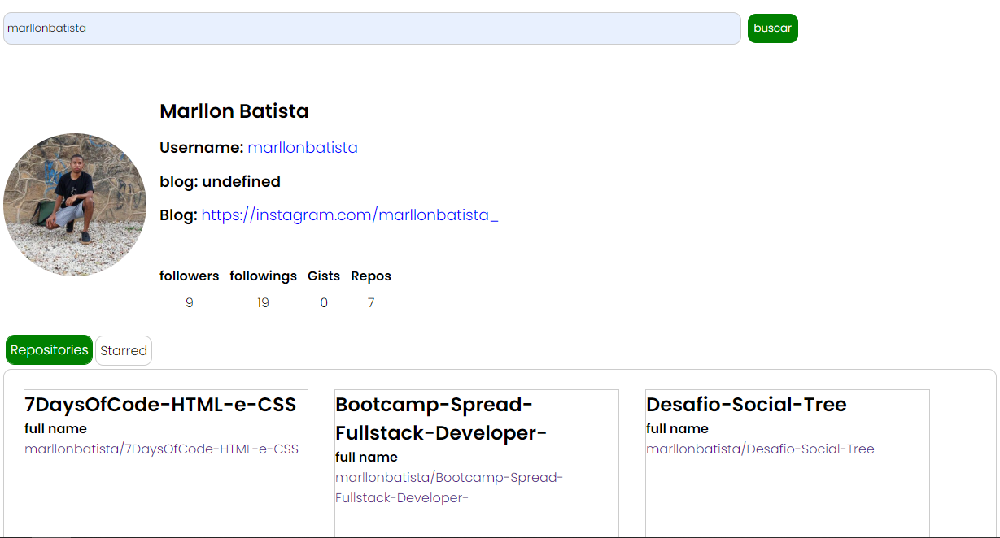

<h1 align="center">
 Github API
</h1>

  

## 🚀 Tecnologias

Esse projeto foi desenvolvido com as seguintes tecnologias:

- React com Vite
- CSS com styled components
- Javascript

## 🎨 Inspiração:

- Você pode encontrar esse desafio no site da 
<a href="https://www.dio.me/">Dio.me</a>

Feito com ♥ by <a href="https://instagram.com/marllonbatista_">Marllon</a>
