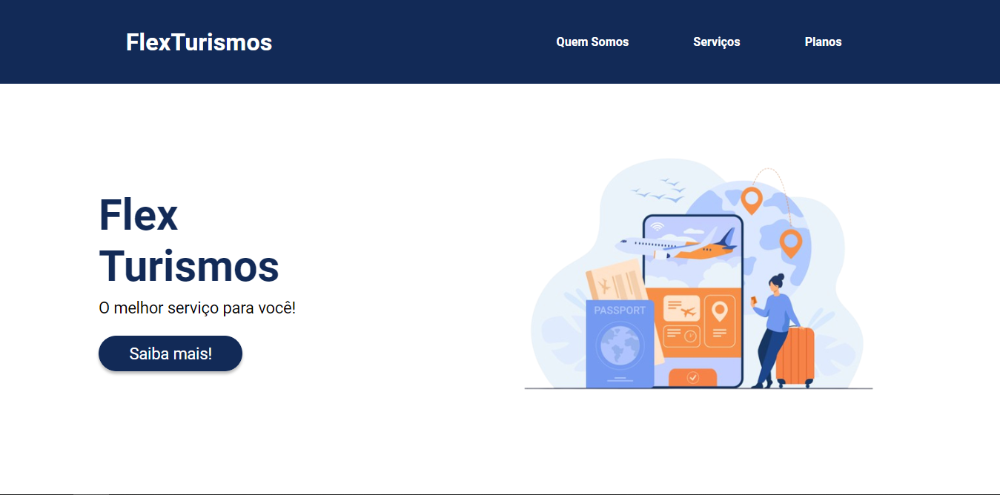
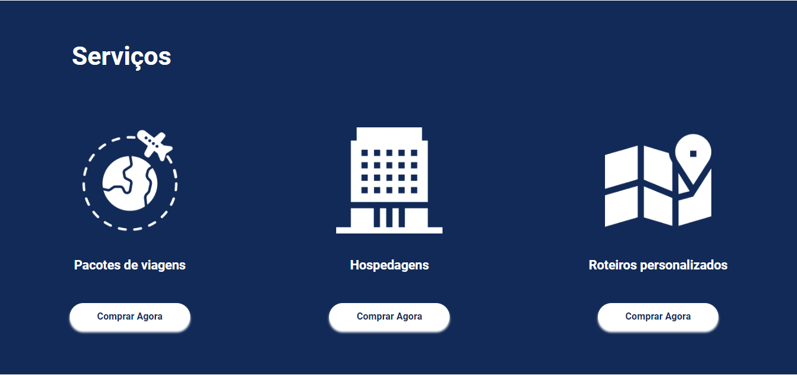
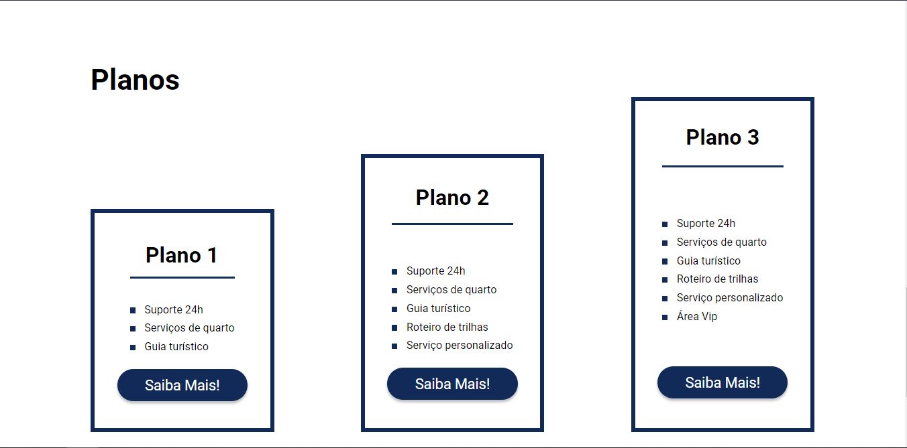

# Projeto Flexbox
O foco desse projeto foi colocar em prática meu conhecimento em flexbox.
## Resultado 👀
### Tela no desktop:

<h2>💻 Linguagens que foram utilizadas:</h2>
 
 
 
 

<h2>​👨🏾‍💻 Autor</h2>
Elaborado por Marllon Batista
  

